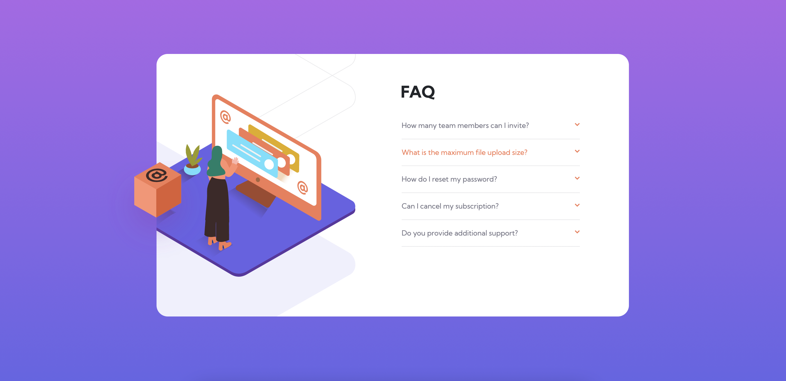
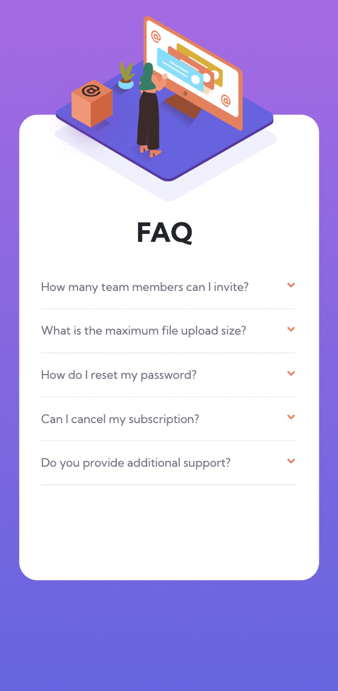

# Frontend Mentor - FAQ accordion card solution

This is a solution to the [FAQ accordion card challenge on Frontend Mentor](https://www.frontendmentor.io/challenges/faq-accordion-card-XlyjD0Oam). Frontend Mentor challenges help you improve your coding skills by building realistic projects. 

## Table of contents

- [Overview](#overview)
  - [The challenge](#the-challenge)
  - [Screenshot](#screenshot)
  - [Link](#links)
- [My process](#my-process)
  - [Built with](#built-with)
  - [What I learned](#what-i-learned)

## Overview

### The challenge

Users should be able to:

- View the optimal layout for the component depending on their device's screen size
- See hover states for all interactive elements on the page
- Hide/Show the answer to a question when the question is clicked

### Screenshot

### Links

- Solution URL: https://ahap13.github.io/faq-accordian-card/

## My process

### Built with

- HTML
- CSS
- JavaScript
- Bootstrap - CSS Library
- jQuery - JS Library

### What I learned

I realized I may have taken some unnecessary steps making the mobile version that I could've avoided by keeping responsiveness in mind while I created the page. Additionally, I am sure I could have made this site without the JS script, however including it was the easiest way for me.

## Author

- LinkedIn - Alec Hapiak (https://www.linkedin.com/in/alec-hapiak/)
